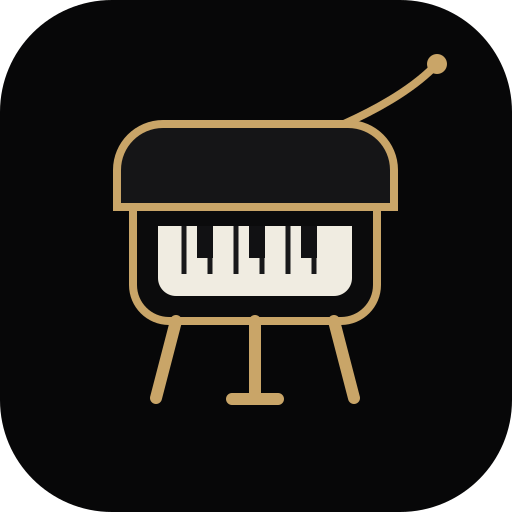

<div align="center">
  

# Virtual Grand Piano

**An interactive 3D concert grand piano for playing, exploring, and inspecting the instrument from the inside out.**

[](https://github.com/phucnguyen020611/virtual-grand-piano/actions/workflows/ci.yml)
[](https://github.com/phucnguyen020611/virtual-grand-piano/actions/workflows/deploy-pages.yml)
[](LICENSE)
[](https://threejs.org/)
[](https://vite.dev/)
</div>

## Overview

Virtual Grand Piano is a browser-based 3D instrument experience focused on two ideas: the expressive feel of a concert grand and the engineering hidden inside it. The first release provides a playable procedural grand piano, a free inspection camera, an exploded anatomy view, a modeled music desk and score, and a cinematic wooden-stage presentation.

The current model is procedural and intentionally lightweight. Future releases can replace or extend individual systems with higher-fidelity meshes, physically based textures, sampled audio, mechanical animation, and more accurate piano-action behavior without changing the overall product concept.

## Features

- Interactive 3D concert grand piano rendered in real time
- Full 88-key keyboard geometry
- Mouse/touch key interaction
- Computer-keyboard performance controls
- Recorded acoustic piano samples with a bounded generated fallback
- Autoplay demonstration using the opening theme of _Für Elise_
- Free orbit, zoom, and pan inspection camera
- Normal inspection mode
- Exploded-parts inspection mode
- Individually modeled major systems:
  - lacquered rim and case
  - lid and prop
  - soundboard and ribs
  - cast-iron plate / harp
  - bass and treble string fields
  - bridge and tuning details
  - hammer action and felt rail
  - 88-key keyboard
  - legs and brass casters
  - pedal lyre and three pedals
  - music desk and 3D score
- Wooden concert stage with a focused overhead lamp
- Soft shadows, glossy reflections, fog, and ACES tone mapping
- Responsive desktop and mobile interface

## Controls

| Action                  | Control                                           |
| ----------------------- | ------------------------------------------------- |
| Orbit camera            | Left-drag / one-finger drag                       |
| Zoom                    | Mouse wheel / pinch                               |
| Pan                     | Right-drag / two-finger drag                      |
| Play visible key        | Press, tap, or drag across piano keys             |
| Play mapped notes       | `Z–/`, `Q–[`, and nearby number-row black keys    |
| Shift keyboard range    | `←` / `→` or **Oct −** / **Oct +**                |
| Sustain                 | `Space` (when a UI control is not focused)        |
| MIDI input              | **MIDI: Connect**, then choose an input if needed |
| Record performance      | **Record**, then **Play Recording**               |
| Inspect component       | Click a piano component                           |
| Separate systems        | **Exploded Parts**                                |
| Restore assembled piano | **Normal Inspect**                                |
| Toggle lid              | **Open Lid / Close Lid**                          |
| Autoplay                | **Für Elise**                                     |
| Restore camera          | **Reset View**                                    |

## Tech stack

| Layer              | Technology     | Purpose                                                                 |
| ------------------ | -------------- | ----------------------------------------------------------------------- |
| 3D / WebGL         | Three.js       | Scene graph, geometry, materials, lighting, raycasting, camera controls |
| Build tooling      | Vite           | Fast local development and optimized production builds                  |
| Audio              | Web Audio API  | Recorded-sample piano playback, acoustic buses, and autoplay            |
| UI                 | HTML + CSS     | Responsive controls and inspector overlays                              |
| CI                 | GitHub Actions | Build verification on pushes and pull requests                          |
| Deployment         | GitHub Pages   | Static production hosting from the `main` branch                        |
| Dependency updates | Dependabot     | Scheduled npm and GitHub Actions update pull requests                   |

## Project structure

```text
virtual-grand-piano/
├── .github/
│   ├── workflows/
│   │   ├── ci.yml
│   │   └── deploy-pages.yml
│   └── dependabot.yml
├── public/
│   └── logo.svg
├── src/
│   ├── main.js                # scene/renderer/camera bootstrap + wiring + render loop
│   ├── piano/
│   │   ├── createPiano.js      # assembles the instrument + exploded-view layout
│   │   ├── anatomy.js          # rim/case, soundboard, plate, strings, action, legs, pedals, lid, desk
│   │   ├── keyboard.js         # 88-key geometry + MIDI lookups
│   │   ├── geometry.js         # dimension table, footprint shapes, mesh helpers
│   │   └── materials.js        # material palette + procedural canvas textures
│   ├── scene/
│   │   ├── stage.js            # wooden concert stage
│   │   └── lighting.js         # overhead lamp + key/fill/rim/hemisphere lights
│   ├── audio/
│   │   ├── pianoAudio.js       # sampler voices, buses, reverb, sustain, pedal noise
│   │   └── pianoSamples.js     # sample manifest + offline sample/IR rendering
│   ├── performance/
│   │   ├── computerKeyboard.js # physical-key layout, octave shift, focus safety
│   │   ├── midiInput.js        # selected Web MIDI input + CC64 handling
│   │   └── performanceRecorder.js # in-memory musical event recording/playback
│   ├── interaction/
│   │   └── inspection.js       # raycasting selection, labels, mode switching
│   └── style.css
├── .editorconfig
├── .gitignore
├── CONTRIBUTING.md
├── LICENSE
├── README.md
├── SECURITY.md
├── index.html
├── package.json
└── vite.config.js
```

## Getting started

### Requirements

- Node.js 22.12 or newer
- npm 10 or newer recommended
- A modern browser with WebGL support

### Install

```bash
npm install
```

### Run locally

```bash
npm run dev
```

Vite will print the local development URL in the terminal.

### Production build

```bash
npm run build
```

### Preview the production build

```bash
npm run preview
```

## Scripts

| Command           | Description                                |
| ----------------- | ------------------------------------------ |
| `npm run dev`     | Start the Vite development server          |
| `npm run build`   | Build optimized static assets into `dist/` |
| `npm run preview` | Serve the production build locally         |
| `npm run check`   | Run the current project validation command |

## Architecture

The implementation is split into focused modules so each system can evolve independently:

1. **Scene and renderer** (`main.js`, `scene/`) establish the WebGL environment, camera, stage, lighting, fog, tone mapping, and shadows.
2. **Procedural piano** (`piano/`) builds the instrument from a shared dimension table. The case is a **hollow curved rim** (an extruded outer contour with an inner cavity hole) rather than a solid plate; the soundboard, cast plate, strings, and action stack in a physically believable vertical order below the rim top so the internal anatomy stays visible. Each major part is a separate, individually selectable Three.js group.
3. **Interaction** (`interaction/inspection.js`) uses raycasting for mouse/touch selection, drives the exploded-view labels, and manages `OrbitControls` for free inspection.
4. **Audio** (`audio/`) is a recorded-sample piano engine with a generated PCM fallback. `pianoSamples.js` owns the manifest and fallback renderer; `pianoAudio.js` owns the voice manager and shared output bus. See [Audio engine](#audio-engine).
5. **Performance input** (`performance/`) maps computer keys, pointer/touch gestures, Web MIDI, and event-recording playback through the same ownership-aware controller.
6. **Animation** (`main.js` render loop) interpolates key travel, lid movement, component separation, labels, and autoplay state.

## Performance input

The computer keyboard exposes roughly 2½ octaves at once, beginning at C3 by
default. Lower-row `Z–/` and upper-row `Q–[` provide the white-key layout;
nearby number/letter keys fill the black keys. Arrow keys or the compact octave
buttons move the range in 12-semitone steps without changing notes already held.
Space is the sustain pedal unless a focused button, link, or form control owns
that key.

Pointer and touch keys use pointer capture: releasing, cancelling, or losing
capture releases only that pointer's token. A held pointer can glide across
keys, and independent touch pointers can form chords. Pen/touch pressure is
used conservatively when available; mouse clicks use a stable velocity.

Web MIDI is requested only from **MIDI: Connect**, without SysEx. The selected
input supports all channels, note-on velocity 1–127, both standard note-off
forms, CC64 sustain, and device-scoped CC120/CC123 cleanup. Unsupported
browsers show an unavailable state; denied permission leaves the instrument
fully playable. MIDI messages and recordings stay in the browser and are never
sent anywhere.

**Recording** stores a small in-memory JSON-like event sequence (`version`,
`durationMs`, note on/off IDs, velocity, and sustain transitions), not audio.
It records computer, pointer, and MIDI performance only—never autoplay or its
own playback. Playback uses the regular `recording` source, so it coexists with
live performance and can be stopped without affecting other sources. Recordings
are intentionally not persisted across page reloads.

The geometry is intentionally procedural; higher-fidelity glTF meshes and PBR textures can replace individual modules without changing the overall product concept.

## Audio engine

The default backend is recorded acoustic piano playback, with generated additive
PCM reserved for a cold load or a failed recorded asset.

|                    |                                                         |
| ------------------ | ------------------------------------------------------- |
| Source             | Salamander Grand Piano V3 — Yamaha C5 recordings        |
| Licence            | CC BY 3.0 (Alexander Holm; attribution below)           |
| Root samples       | 16, from A0 through C8                                  |
| Velocity layers    | 3 real captures (original layers 4 / 9 / 14) = 48 files |
| Shipped asset size | 3.56 MiB Ogg/Opus, mono 48 kHz                          |
| Decoded cache      | 56 MiB bounded working set (about 48 MiB pinned core)   |
| Polyphony          | 64 voices                                               |

**Attribution.** “Salamander Grand Piano V3 by Alexander Holm, licensed under
CC BY 3.0.” The compact local Ogg/Opus assets are format/channel/bitrate
conversions of the source recordings. See [third-party audio attribution](THIRD_PARTY_AUDIO.md)
for source URLs, licence details, source velocity layers, and modifications.

**Mapping.** Each MIDI note picks its nearest root and plays it at
`2^((midi - rootMidi) / 12)`. The measured full-range transposition bound is
**+3 / -2 semitones** (never more than ±3). Soft↔medium blends continuously
from velocity 0.30–0.46; medium↔forte does the same from 0.64–0.80. The blend
uses equal-power gains, so it is one logical voice even when it has two sample
source nodes.

**Lazy decode and cache.** The data-driven manifest uses public assets beneath
`${import.meta.env.BASE_URL}audio/salamander/`, which works under both local
development and the GitHub Pages repository base path. The C3–C6 mapped range
(roots D♯3 through A5, all three layers) is pinned and decoded first; this is
about 48 MiB of mono 48 kHz PCM. Bass and high-register captures load only when
played. Recorded and fallback buffers share a 56 MiB LRU-like decoded cache:
unpinned recorded entries are evicted first, then generated fallbacks, while an
active `AudioBufferSourceNode` continues safely after its cache entry is gone.
Concurrent requests for one root/layer share one fetch/decode promise.

**Fallback.** If a recording fails to load, or no recording has reached the
requested note yet during cold load, the engine immediately generates an
additive PCM fallback for that attack and queues the recording for a later
attack. It never crossfades synthetic and recorded layers in one note. Once a
recording is ready it wins for future notes and replaces its fallback cache
entry. The DEV audio hook offers side-effect-free `sampleForMidi()`, bounded
cache `cacheStats()`, plus `voiceStats()`, `resonanceStats()`, and
`pedalStats()` diagnostics before or after audio initialization.

## Operations

### Continuous integration

`.github/workflows/ci.yml` runs on pushes to `main` and on pull requests. The workflow installs the pinned project dependencies and verifies that the production build succeeds.

### GitHub Pages deployment

`.github/workflows/deploy-pages.yml` builds and deploys `dist/` whenever `main` changes. The Vite base path is configured for this repository name.

For the first deployment, repository administrators should confirm **Settings → Pages → Build and deployment → Source → GitHub Actions**.

Expected Pages URL:

```text
https://phucnguyen020611.github.io/virtual-grand-piano/
```

### Dependency maintenance

Dependabot checks npm packages and GitHub Actions weekly. Update pull requests should be reviewed and validated by CI before merging.

### Performance guidance

When adding production assets:

- Prefer glTF/GLB for complex meshes.
- Compress geometry where practical.
- Use GPU-friendly PBR texture sizes and modern compressed texture formats when supported.
- Lazy-load large audio and model resources.
- Keep render-loop allocations minimal.
- Measure frame time on integrated GPUs and mobile devices before increasing polygon or shadow-map budgets.

## Roadmap

- [ ] High-fidelity grand piano GLB model
- [ ] PBR lacquer, wood, felt, steel, brass, and cast-plate textures
- [ ] Expand the compact recorded piano set toward chromatic 88-key coverage
- [ ] Sustain, sostenuto, and soft pedal behavior
- [ ] Animated dampers, hammers, repetition levers, and key action
- [ ] Visible string vibration and resonance feedback
- [ ] More accurate duplex scaling, agraffes, tuning pins, and bridge geometry
- [ ] Multiple classical autoplay pieces
- [ ] MIDI input support
- [ ] Optional guided anatomy tour
- [ ] Performance quality presets for desktop and mobile GPUs

## Contributing

Contributions are welcome. Please read [CONTRIBUTING.md](CONTRIBUTING.md) before opening a pull request.

## Contributors

<table>
  <tr>
    <td align="center">
      <a href="https://github.com/phucnguyen020611">
        <br />
        <sub><b>Techfis-PhucNguyen</b></sub>
      </a><br />
      <sub>Creator & Maintainer</sub>
    </td>
  </tr>
</table>

See the repository's [contributors graph](https://github.com/phucnguyen020611/virtual-grand-piano/graphs/contributors) as the project grows.

## License

This project is licensed under the [MIT License](LICENSE).

## Trademark notice

This is an independent educational and experimental 3D project. Any referenced piano brand names or marks remain the property of their respective owners. This project is not endorsed by or affiliated with Steinway & Sons or any other piano manufacturer.
