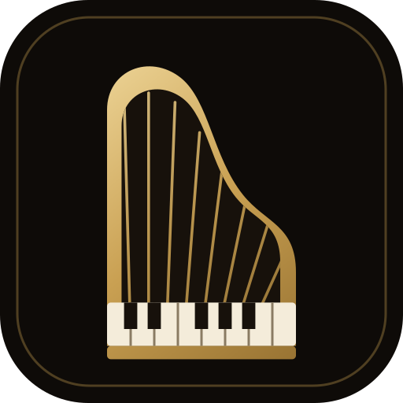

<div align="center">
  

# Virtual Grand Piano

**An interactive 3D concert grand piano for playing, exploring, and inspecting the instrument from the inside out.**

[](https://github.com/phucnguyen020611/virtual-grand-piano/actions/workflows/ci.yml)
[](https://github.com/phucnguyen020611/virtual-grand-piano/actions/workflows/deploy-pages.yml)
[](LICENSE)
[](https://threejs.org/)
[](https://vite.dev/)
</div>

## Overview

Virtual Grand Piano is a browser-based 3D instrument experience focused on two ideas: the expressive feel of a concert grand and the engineering hidden inside it. The first release provides a playable procedural grand piano, a free inspection camera, an exploded anatomy view, a modeled music desk and score, and a European court-style concert hall (gilded columns, coffered ceiling, crystal chandeliers, glowing Sainte-Chapelle-style stained glass casting coloured sunbeams, between portraits of eight great composers, an organ beneath Mengs's _Parnassus_ in a gilt frame, a herringbone parquet stage, carpeted stairs with a gilt balustrade, and stepped velvet stalls with a royal aisle runner) with the piano side-on to the audience as at a recital.

The current model is procedural and intentionally lightweight. Future releases can replace or extend individual systems with higher-fidelity meshes, physically based textures, sampled audio, mechanical animation, and more accurate piano-action behavior without changing the overall product concept.

## Features

- Interactive 3D concert grand piano rendered in real time
- Full 88-key keyboard geometry
- Mouse/touch key interaction
- Computer-keyboard performance controls
- Recorded acoustic piano samples with a bounded generated fallback
- Any MIDI file: **Open MIDI…** or drop a `.mid` on the page and it joins the
  playlist, pedalling and all
- Practice mode: the light columns stop on the keys of each chord until you
  play it, for both hands or one (the other hand plays along), at 100%, 75% or
  50% tempo
- Autoplay playlist of five simplified pieces (Beethoven, Pachelbel, Bach and
  a traditional hymn) with hand-coloured key glow, falling
  crystal light columns, star-dust sparkles and the composer's portrait
  projected, lantern-show style, on the rear wall
- Closing credits that roll up the same lantern projection (its beam visible in
  the haze from the lens on the lighting pipe), worn like old film
  (gate weave, grain, scratches, dust and flicker), ending on the developer's
  card
- An engraved, page-turning score book on the music desk (click a page to turn)
  that follows autoplay: a gilt wash on the bar being played, a line sweeping
  through it
- Sound that follows the camera: close and dry at the keyboard, quieter,
  darker and more reverberant toward the back of the stalls and the balconies,
  panned toward the piano
- Free orbit, zoom-to-cursor and pan camera with view presets (pianist,
  keyboard, front row, balcony, whole hall) and double-click to orbit a spot
- Exploded view: pick a part’s name to fly the camera to it
- Normal inspection mode
- Exploded-parts inspection mode
- Individually modeled major systems:
  - lacquered rim and case
  - lid and prop
  - sliding fallboard (key cover)
  - soundboard and ribs
  - cast-iron plate / harp
  - bass and treble string fields
  - bridge and tuning details
  - hammer action and felt rail
  - 88-key keyboard
  - legs and brass casters
  - pedal lyre and three pedals
  - music desk and 3D score
- Herringbone stage lit from a real rig: Fresnels and a profile lantern hung
  in yokes on a front-of-house pipe and an electric over the stage, each light
  coming from its own glowing lens
- Ways in and out: double exit doors under a lit ISO 7010 exit sign, stage doors with
  velvet portières in the wings, and a grand stair up the rear wall to each
  balcony
- Period lamps: opal globes on turned brass posts along the balconies, scrolled
  two-candle sconces, candle sleeves on the chandeliers
- Sunbeams with glinting dust and passing-cloud shimmer, under a sky that
  follows your clock (or your choice): white day light, long low amber shafts
  at sunset, faint blue moonlight at night
- A concert ritual: a two-note chime as the house lamps go down and the stage
  stays lit, then applause from an audience of some 190 in court dress
  (gilt-trimmed frock coats, powdered hair; ball gowns, gloves and tiaras), who
  sway with the music and clap at the end of each piece (**Audience** shows or
  hides them; Low graphics starts without)
- Royal scrollbars: slim gilt thumbs on dark lacquer, on cream in the programme
- A printed concert programme (click any seat, or **Programme**): every piece
  with its composer and a line about it, each ready to play
- Soft shadows, glossy reflections, fog, and ACES tone mapping
- Responsive desktop and mobile interface

## Controls

| Action                  | Control                                           |
| ----------------------- | ------------------------------------------------- |
| Orbit camera            | Left-drag / one-finger drag                       |
| Zoom                    | Mouse wheel / pinch                               |
| Pan                     | Right-drag / two-finger drag                      |
| Play visible key        | Press, tap, or drag across piano keys             |
| Play mapped notes       | `Z–/`, `Q–[`, and nearby number-row black keys    |
| Shift keyboard range    | `←` / `→` or **Oct −** / **Oct +**                |
| Sustain                 | `Space` (when a UI control is not focused)        |
| MIDI input              | **Connect MIDI**, then choose an input if needed  |
| Record performance      | **Record**, then **Play recording**               |
| Save the take as sound  | **Save audio** after recording                    |
| Soft / sostenuto pedal  | Click the left / middle pedal, or MIDI CC67 / 66  |
| Inspect component       | Click a piano component                           |
| Separate systems        | **Exploded**                                      |
| Restore assembled piano | **Normal**                                        |
| Toggle lid              | **Open Lid / Close Lid**                          |
| Cover the keys          | **Close fallboard / Open fallboard**              |
| Clean view              | **Hide HUD / Show HUD** (top right)               |
| Closing credits         | **Credits** (top right); press again to close     |
| Graphics quality        | **Graphics: Low / Medium / High / Ultra**         |
| Daylight outside        | **Sky:** your clock / day / sunset / night        |
| Concert programme       | Click any seat, or **Programme**                  |
| Show / hide audience    | **Audience**                                      |
| House curtain & lights  | **Close curtain / Open curtain**                  |
| Adjust bench height     | Click a knob at either end of the bench           |
| Walk the hall           | **Free cam**, then `↑↓` walk, `←→` turn, `Shift`  |
| Autoplay                | **5-piece playlist**, pedalled, with a soundwave  |
| Play your own MIDI      | **Open MIDI…**, or drop a `.mid` file anywhere    |
| Practise a piece        | **Practice:** both / right / left hand, **Tempo** |
| Restore camera          | **Reset View**                                    |

## Tech stack

| Layer              | Technology     | Purpose                                                                 |
| ------------------ | -------------- | ----------------------------------------------------------------------- |
| 3D / WebGL         | Three.js       | Scene graph, geometry, materials, lighting, raycasting, camera controls |
| Build tooling      | Vite           | Fast local development and optimized production builds                  |
| Audio              | Web Audio API  | Recorded-sample piano playback, acoustic buses, and autoplay            |
| UI                 | HTML + CSS     | Responsive controls and inspector overlays                              |
| CI                 | GitHub Actions | Build verification on pushes and pull requests                          |
| Deployment         | GitHub Pages   | Static production hosting from the `main` branch                        |
| Dependency updates | Dependabot     | Scheduled npm and GitHub Actions update pull requests                   |

## Project structure

```text
virtual-grand-piano/
├── .github/
│   ├── workflows/
│   │   ├── ci.yml
│   │   └── deploy-pages.yml
│   └── dependabot.yml
├── public/
│   ├── art/parnassus.jpg   # Mengs, Parnassus (public domain)
│   ├── art/composers/      # eight composer portraits (public domain)
│   ├── art/developer.jpg   # the developer's GitHub picture, for the credits
│   ├── art/exit-sign.svg   # ISO 7010 exit sign (public domain)
│   ├── audio/hall/         # the chime and the applause (CC0 excerpts)
│   └── logo.svg
├── src/
│   ├── main.js                # scene/renderer/camera bootstrap + wiring + render loop
│   ├── piano/
│   │   ├── createPiano.js      # assembles the instrument + exploded-view layout
│   │   ├── anatomy.js          # rim/case, soundboard, plate, strings, action, legs, pedals, lid, desk
│   │   ├── keyboard.js         # 88-key geometry + MIDI lookups
│   │   ├── geometry.js         # dimension table, footprint shapes, mesh helpers
│   │   └── materials.js        # material palette + procedural canvas textures
│   ├── scene/
│   │   ├── hall.js             # concert hall, stage and lighting rig
│   │   ├── royalDecor.js       # gilt, chandeliers, sconces, balustrades, drapes, portraits
│   │   ├── stainedGlass.js     # stained-glass lancets, their wall light and sunbeams
│   │   ├── composerProjection.js # old-film lantern on the rear wall: composer or credits
│   │   ├── credits.js          # the closing credits roll and the developer's card
│   │   ├── stageLighting.js    # lighting pipes, instruments in yokes, the lantern
│   │   ├── passages.js         # exit doors, stage doors in the wings, balcony stairs
│   │   ├── audience.js         # the seated audience: sway and applause
│   │   ├── surfaces.js         # procedural PBR sets (parquet, damask, velvet, runner…)
│   │   └── noteEffects.js      # autoplay key glow, light columns, star dust
│   ├── audio/
│   │   ├── pianoAudio.js       # sampler voices, buses, reverb, sustain, pedal noise
│   │   └── pianoSamples.js     # sample manifest + offline sample/IR rendering
│   ├── performance/
│   │   ├── computerKeyboard.js # physical-key layout, octave shift, focus safety
│   │   ├── midiInput.js        # selected Web MIDI input + CC64 handling
│   │   ├── performanceRecorder.js # in-memory musical event recording/playback
│   │   └── midiFile.js         # Standard MIDI File reader for the playlist
│   ├── interaction/
│   │   ├── dropdown.js         # styled, accessible dropdowns over native selects
│   │   └── inspection.js       # raycasting selection, labels, mode switching
│   └── style.css
├── docs/                   # project documents (see Documentation)
├── tests/                  # regression checks and browser test pages
├── .editorconfig
├── .gitignore
├── LICENSE
├── README.md
├── index.html
├── package.json
└── vite.config.js
```

## Getting started

### Requirements

- Node.js 22.12 or newer
- npm 10 or newer recommended
- A modern browser with WebGL support

### Install

```bash
npm ci
```

The committed lockfile keeps local, CI, and deployment installs reproducible.

### Run locally

```bash
npm run dev
```

Vite will print the local development URL in the terminal.

### Production build

```bash
npm run build
```

### Preview the production build

```bash
npm run preview
```

## Scripts

| Command                | Description                                           |
| ---------------------- | ----------------------------------------------------- |
| `npm run dev`          | Start the Vite development server                     |
| `npm run build`        | Build optimized static assets into `dist/`            |
| `npm run preview`      | Serve the production build locally                    |
| `npm test`             | Run dependency-free input/ownership regression checks |
| `npm run format:check` | Check formatting                                      |

## Architecture

The implementation is split into focused modules so each system can evolve independently:

1. **Scene and renderer** (`main.js`, `scene/`) establish the WebGL environment, camera, stage, lighting, fog, tone mapping, and shadows.
2. **Procedural piano** (`piano/`) builds the instrument from a shared dimension table. The case is a **hollow curved rim** (an extruded outer contour with an inner cavity hole) rather than a solid plate; the soundboard, cast plate, strings, and action stack in a physically believable vertical order below the rim top so the internal anatomy stays visible. Each major part is a separate, individually selectable Three.js group.
3. **Interaction** (`interaction/inspection.js`) uses raycasting for mouse/touch selection, drives the exploded-view labels, and manages `OrbitControls` for free inspection.
4. **Audio** (`audio/`) is a recorded-sample piano engine with a generated PCM fallback. `pianoSamples.js` owns the manifest and fallback renderer; `pianoAudio.js` owns the voice manager and shared output bus. See [Audio engine](#audio-engine).
5. **Performance input** (`performance/`) maps computer keys, pointer/touch gestures, Web MIDI, and event-recording playback through the same ownership-aware controller.
6. **Animation** (`main.js` render loop) interpolates key travel, lid movement, component separation, labels, and autoplay state.

## Performance input

The computer keyboard exposes roughly 2½ octaves at once, beginning at C3 by
default. Lower-row `Z–/` and upper-row `Q–[` provide the white-key layout;
nearby number/letter keys fill the black keys. Arrow keys or the compact octave
buttons move the range in 12-semitone steps without changing notes already held.
At either physical-range boundary the unavailable octave control is disabled,
so the range never makes a partial, non-octave shift.
Space is the sustain pedal unless a focused button, disclosure, link, or form control owns
that key. Browser focus loss and MIDI disconnects perform normal musical
releases, while the Autoplay and Recording Stop controls intentionally use
source-scoped force-stop behavior.

Pointer and touch keys use pointer capture: releasing, cancelling, or losing
capture releases only that pointer's token. A held pointer can glide across
keys, and independent touch pointers can form chords. Pen/touch pressure is
used conservatively when available; mouse clicks use a stable velocity.

Click the piano surface or Tab back to it after using controls. Browser shortcuts
with Control, Command, or Alt and IME composition are never used as piano input.
Pointer notes and pedals release on blur or page hiding, including simultaneous
key/pedal gestures.

Web MIDI is requested only from **Connect MIDI**, without SysEx. The selected
input supports all channels, note-on velocity 1–127, both standard note-off
forms, CC64 sustain, and channel-scoped CC120/CC123 held-note cleanup. Unsupported
browsers show an unavailable state; denied permission leaves the instrument
fully playable. MIDI messages and recordings stay in the browser and are never
sent anywhere.

**Recording** stores a small in-memory JSON-like event sequence (`version`,
`durationMs`, note on/off IDs, velocity, and sustain transitions), not audio.
It records computer, pointer, and MIDI performance only—never autoplay or its
own playback. Playback uses the regular `recording` source, so it coexists with
live performance and can be stopped without affecting other sources. Recordings
are intentionally not persisted across page reloads. Playback is disabled while
recording so the event list stays immutable during playback.

Each take is also captured as sound, exactly as heard (room, pedal and all),
with a two-second ring-out: **Save audio** downloads it as WebM/Opus (or M4A
where the browser records only MP4). The file never leaves the browser until
you save it.

The geometry is intentionally procedural; higher-fidelity glTF meshes and PBR textures can replace individual modules without changing the overall product concept.

## Audio engine

The default backend is recorded acoustic piano playback, with generated additive
PCM reserved for a cold load or a failed recorded asset.

|                    |                                                         |
| ------------------ | ------------------------------------------------------- |
| Source             | Salamander Grand Piano V3 — Yamaha C5 recordings        |
| Licence            | CC BY 3.0 (Alexander Holm; attribution below)           |
| Root samples       | 30, every Salamander root from A0 through C8            |
| Velocity layers    | 3 real captures (original layers 4 / 9 / 14) = 90 files |
| Shipped asset size | 6.89 MiB Ogg/Opus, mono 48 kHz                          |
| Decoded cache      | 160 MiB desktop / 56 MiB touch (about 37 MiB pinned)    |
| Polyphony          | 64 voices                                               |

**Attribution.** “Salamander Grand Piano V3 by Alexander Holm, licensed under
CC BY 3.0.” The compact local Ogg/Opus assets are format/channel/bitrate
conversions of the source recordings. See [third-party audio attribution](docs/THIRD_PARTY_AUDIO.md)
for source URLs, licence details, source velocity layers, and modifications.
The repository's MIT licence covers this project's code; the included recorded
sample derivatives remain available under their CC BY 3.0 attribution terms.

**Mapping.** Each MIDI note picks its nearest root and plays it at
`2^((midi - rootMidi) / 12)`. The measured full-range transposition bound is
**±1 semitone**. If the nearest root is still loading or was evicted, the
nearest warm neighbour (at most ±3) plays instead of generated PCM. Soft↔medium blends continuously
from velocity 0.30–0.46; medium↔forte does the same from 0.64–0.80. The blend
uses equal-power gains, so it is one logical voice even when it has two sample
source nodes.

**Lazy decode and cache.** The data-driven manifest uses public assets beneath
`${import.meta.env.BASE_URL}audio/salamander/`, which works under both local
development and the GitHub Pages repository base path. The C3–C6 mapped range
(roots A2 through A5, all three layers) is decoded first. A2 is required
because C3 maps down three semitones to that root. The context uses 48 kHz
and an interactive latency hint. Medium/forte captures in that range are
pinned (about 37 MiB); soft captures are evictable. This leaves space for
bass and high-register playing without permanently pinning the entire warmup.
On desktop (fine pointer) the C/F# roots from C3 to F#5 then decode in the
background, evictable, followed by the medium capture of every bass and
treble root (treble first; about 42 MiB in all), so neither end of the keyboard
opens on generated fallback. On touch devices, bass and high-register captures
load only when played. Recorded and fallback buffers share an LRU-like decoded
cache (160 MiB desktop, 56 MiB touch devices):
unpinned recordings and generated fallbacks are evicted by last use, while an
active `AudioBufferSourceNode` continues safely after its cache entry is gone.
Concurrent requests for one root/layer share one fetch/decode promise. Failed
requests have a 15-second network timeout and a 30-second retry cooldown; a
later attack can recover after a transient failure without a request storm.

**Fallback.** Entry briefly prepares generated forte fallbacks for the first
computer key (C3’s A2 root), A0 and C8, yielding between buffers. This moves
that synthesis cost before performance; other cold roots and velocity layers
can still incur synchronous synthesis. If a recording fails to load, or no recording has reached the
requested note yet during cold load, the engine immediately generates an
additive PCM fallback for that attack and queues the recording for a later
attack. It never crossfades synthetic and recorded layers in one note. Once a
recording is ready it wins for future notes and replaces its fallback cache
entry. The DEV audio hook offers side-effect-free `sampleForMidi()`, bounded
cache `cacheStats()`, plus `voiceStats()`, `resonanceStats()`, and
`pedalStats()` diagnostics before or after audio initialization.

## Operations

### Continuous integration

`.github/workflows/ci.yml` runs on pushes to `main` and on pull requests. The workflow installs the pinned project dependencies, checks formatting, runs the
input/ownership regression checks, and verifies the production build.

### GitHub Pages deployment

`.github/workflows/deploy-pages.yml` builds and deploys `dist/` whenever `main` changes. The Vite base path is configured for this repository name.

For the first deployment, repository administrators should confirm **Settings → Pages → Build and deployment → Source → GitHub Actions**.

Expected Pages URL:

```text
https://phucnguyen020611.github.io/virtual-grand-piano/
```

### Dependency maintenance

Dependabot checks npm packages and GitHub Actions weekly. Update pull requests should be reviewed and validated by CI before merging.

## Release readiness

### QA matrix

Record each release candidate with the result categories **PASS**, **FAIL**,
**PARTIAL**, or **NOT AVAILABLE**. Do not infer hardware coverage from browser
emulation.

| Area              | Release-candidate coverage                                                                                             |
| ----------------- | ---------------------------------------------------------------------------------------------------------------------- |
| Desktop           | Chromium/Chrome-class; Firefox; Safari/WebKit where available                                                          |
| Mobile and tablet | iOS/WebKit, Android/Chromium, and responsive portrait/landscape checks                                                 |
| Input             | Mouse, computer keyboard, touch, multi-touch, and Web MIDI hardware where available                                    |
| Core flows        | Audio unlock/warmup/fallback, sustain, autoplay, recording/playback, inspection, lid, camera, help, and responsive HUD |
| Production        | Console, asset/base-path requests, CI, Pages, and deployed smoke test                                                  |

### Browser and device support

- **Recommended:** current Chromium-based browsers. Release-candidate desktop
  smoke testing covers audio unlock, recorded-sample warmup, keyboard input,
  recording/playback, autoplay, inspection, and the responsive HUD.
- **Firefox and Safari/WebKit:** supported targets that require a release-candidate
  smoke test on the intended browser before broad compatibility is claimed.
  Ogg/Opus requires Safari 18.4 on macOS 15.4 / iOS 18.4 or newer, as
  [documented by WebKit](https://webkit.org/blog/16574/webkit-features-in-safari-18-4/).
  Older Safari/OS combinations may use generated fallback audio. No alternate
  encoded sample library is downloaded or decoded.
- **Touch:** pointer-based touch interaction is supported. Verify multi-touch and
  orientation behavior on representative hardware for each release.
- **Web MIDI:** optional and browser/device-dependent. The piano remains fully
  playable without it; a denied or unavailable MIDI request is surfaced in the
  HUD.
- **Audio:** a user gesture is required to start audio. During a cold load or a
  failed sample request, a generated fallback responds while local
  recorded samples warm up.

### Release checklist

- Run `npm ci --no-audit --no-fund`, `npm run format:check`, `npm run build`,
  `npm test`, and `npm run preview` from the committed lockfile.
- With `npm run dev` running, open `/virtual-grand-piano/tests/browser.html`
  for renderer/audio/input/layout checks and a three-minute session soak.
  Open `/virtual-grand-piano/tests/failures.html` for simulated network, decoder,
  AudioContext and WebGL failures. These test pages are excluded from the build.
- Confirm CI and GitHub Pages succeed for the exact release SHA.
- Smoke-test the deployed Pages URL, including audio unlock, one keyboard note,
  recording/playback, autoplay, inspection, and browser console/network errors.
- Check keyboard focus, help dismissal, reduced motion, and responsive layouts
  at desktop, tablet, and mobile dimensions.
- Confirm audio attribution remains in [THIRD_PARTY_AUDIO.md](docs/THIRD_PARTY_AUDIO.md)
  when audio assets change.

### Performance guidance

When adding production assets:

- Prefer glTF/GLB for complex meshes.
- Compress geometry where practical.
- Use GPU-friendly PBR texture sizes and modern compressed texture formats when supported.
- Lazy-load large audio and model resources.
- Keep render-loop allocations minimal.
- Measure frame time on integrated GPUs and mobile devices before increasing polygon or shadow-map budgets.

## Quality and known limits

Portrait framing and a 1.5 DPR cap on narrow/coarse-pointer devices keep the
full piano visible at a lower pixel cost. The lamp fixture is hidden in portrait;
its lights still illuminate the piano. Controls collapse below 1181px and become
scrollable at short heights. Reduced motion snaps camera/assembly transitions
and lid movement while retaining musical key/action feedback.

The model is an educational representation: one string course per key, evenly
spaced at the strike line. The soft pedal makes new notes quieter and mellower
(una corda) and the sostenuto holds the dampers of the notes down when it is
pressed (click the pedals, or MIDI CC67 and CC66). The score book is engraved from the same data autoplay plays
(`src/performance/songs.js`). No guided tour or presentation mode is included
in this pass.

See [the Phase 9 audit](docs/PHASE9_AUDIT.md) for evidence, decisions and
regression coverage. Hardware MIDI, real mobile/touch behavior, listening tests
and prolonged multi-hour sessions still require human/device validation.

## Documentation

Everything beyond this README lives in [`docs/`](docs/):

| Document                                          | What it covers                                        |
| ------------------------------------------------- | ----------------------------------------------------- |
| [CONTRIBUTING.md](docs/CONTRIBUTING.md)           | Workflow, commit convention and code guidelines       |
| [SECURITY.md](docs/SECURITY.md)                   | Supported version and how to report a vulnerability   |
| [THIRD_PARTY_AUDIO.md](docs/THIRD_PARTY_AUDIO.md) | Salamander Grand Piano samples: source and licence    |
| [THIRD_PARTY_ART.md](docs/THIRD_PARTY_ART.md)     | Paintings and portraits in the hall, and the credits  |
| [MODEL_CORRECTIONS.md](docs/MODEL_CORRECTIONS.md) | Corrections made to the piano model, and why          |
| [PHASE9_AUDIT.md](docs/PHASE9_AUDIT.md)           | Phase 9 audit: evidence, decisions, regression checks |

## Contributing

Contributions are welcome. Please read [CONTRIBUTING.md](docs/CONTRIBUTING.md) before opening a pull request.

## Contributors

<table>
  <tr>
    <td align="center">
      <a href="https://github.com/phucnguyen020611">
        <br />
        <sub><b>Techfis-PhucNguyen</b></sub>
      </a><br />
      <sub>Creator & Maintainer</sub>
    </td>
  </tr>
</table>

See the repository's [contributors graph](https://github.com/phucnguyen020611/virtual-grand-piano/graphs/contributors) as the project grows.

## License

Project code is licensed under the [MIT License](LICENSE). The Salamander
recording derivatives remain CC BY 3.0; see [audio attribution](docs/THIRD_PARTY_AUDIO.md).
The stage painting, Anton Raphael Mengs's _Parnassus_ (1761), and the eight
composer portraits on the side walls are in the public domain; the developer's
picture in the credits is their own. See
[art attribution](docs/THIRD_PARTY_ART.md).

## Trademark notice

This is an independent educational and experimental 3D project. Any referenced piano brand names or marks remain the property of their respective owners. This project is not endorsed by or affiliated with Steinway & Sons or any other piano manufacturer.
